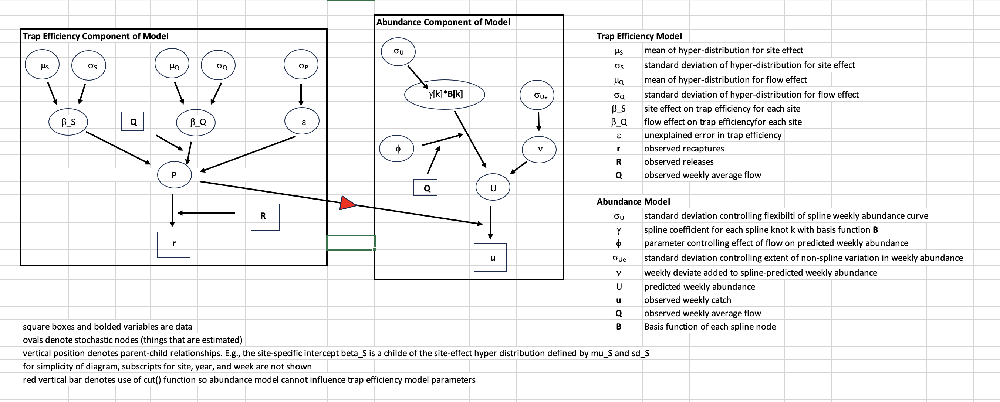

```{r, include = FALSE}
knitr::opts_chunk$set(
  collapse = TRUE,
  comment = "#>",
  fig.width = 7,
  fig.height = 5
)
```

```{r setup, include = FALSE}
library(ggplot2)
library(tidyverse)
library(bayesplot)
library(wesanderson)
library(SRJPEdata)
library(SRJPEmodel)
```

## Overview

BT-SPAS-X is a Bayesian model that estimates the weekly abundance of outmigrating Chinook at RST sites in Central Valley tributaries and the mainstem Sacramento River. Weekly estimates can be summed to calculate annual outmigrant abundance. To account for many sites and years with limited trap efficiency data or where few recaptures are obtained, the model uses trap efficiency data from multiple years and sites to estimate trap efficiency for any given site-week. Estimates of Chinook outmigrant abundance in a given week can be converted to estimates of spring run outmigrant abundance in a post-processing step using predictions from a probability length-at-date model that was fit using genetic data.

## Submodel Objective

BT-SPAS-X estimates juvenile abundance needed for the stock recruit model or a within season outmigrant forecast model. BT-SPAS-X was specifically designed to address the often-sparse trap efficiency data available to estimate abundance at any given RST site. Trap efficiency is predicted based on a hierarchical model that estimates site-specific means, site-specific flow effects, and process error. Weekly abundance is estimated using a spline model that is fit to the weekly catch data given weekly estimates of trap efficiency. The spline model allows estimation of abundance in weeks when the trap was not operated.

The input data for the model includes weekly catch ($u$ in Figure 2 below), trap efficiency data (releases $R$ and recaptures $r$ ), and weekly average flow $Q$). The model outputs weekly estimates of abundance and uncertainty and weekly estimates of trap efficiency and uncertainty. Length frequency data for each week is required if calculating abundance by run type in a post-processing step using the PLAD model.

## Conceptual model

BT-SPAS-X estimates juvenile abundance needed for the stock recruit model or a within season outmigrant forecast model. See figure 1 below to see how it fits into the full JPE model system.

*Figure 1: Conceptual Diagram of SRJPE model. BTSPAS X sub-model highlighted in yellow*


## Submodel Architecture

There are two main components of the model: trap efficiency and abundance estimation (Figure 1). The trap efficiency component estimates parameters of a global trap efficiency model by fitting to data from more than 900 efficiency trials across all available tributary RST sites. This model is then used to estimate trap efficiency for each week in a run year (November 1-June 1) at the site for which the abundance model is run. There are three levels for the trap efficiency model. The lowest level is where the predicted trap efficiency ($P$) for any site, year, and week with trap efficiency data is compared to the data. The next level is where site, year, and week-specific trap efficiencies are estimated. The highest level is represented by hyper-distributions which define the distributions where site specific parameters are estimated.

*Figure 2. Directed acyclic diagram (DAG) showing the hierarchical structure of the trap efficiency component of BT-SPAS-X and how predictions of trap efficiency are by the abundance component of the model. Ovals denote stochastic nodes (variables that are estimated) while squares with bolded text denote data. Arrows indicate the direction of influence. For example, the hyper parameters μS and σS define a normal distribution from which site specific intercepts β_S are drawn. The red triangle indicates that trap efficiency estimates contribute to estimates of abundance, but that abundance model parameters do not influence trap efficiency parameters.*



# Model inputs

The model takes in a few datasets:

-   **Weekly Juvenile Abundance Model Data** Weekly catch, efficiency, flow, and log normal priors needed to run the model. This is in the `SRJPEdata::weekly_juvenile_abundance_catch_data` and `SRJPEdata::weekly_juvenile_abundance_efficiency_data` data objects.
-   **BTSPAS params** Bayesian estimation specifications. `SRJPEmodel::bt_spas_x_bayes_params`

These datasets are prepared for STAN and BUGS models using the `prepare_pCap_inputs()` & the `prepare_abundance_inputs()` functions (see example below for more details.

# Running BTSPAS-X submodel

Below is an example for the upper battle creek RST in 2018.

```{r, eval = FALSE}
# bt-spas-x ---------------------------------------------------------------
# example for upper battle creek (ubc) 2018 (trib)

# run pCap model
pCap_inputs <- prepare_pCap_inputs(mainstem = FALSE)
pCap <- fit_pCap_model(pCap_inputs$inputs)

# run abundance model
abundance_inputs <- prepare_abundance_inputs("ubc", 2018, effort_adjust = T, pCap)
abundance <- fit_abundance_model_BUGS(abundance_inputs,
                                      # point towards where you store the .bug model
                                      "C:/Users/Liz/Documents/SRJPEmodel/model_files/abundance_model.bug",
                                      # point to where you have WinBUGS
                                      "C:/Users/Liz/Documents/SRJPEmodel/data-raw/WinBUGS14")
```

# Model Output

```{r, eval = FALSE}
abundance_table <- extract_abundance_estimates("ubc", 2018, abundance_inputs, abundance)

generate_diagnostic_plot_juv(inputs = abundance_inputs, results_df = abundance_table)
```

```{r, echo = FALSE, warning = FALSE, message=FALSE}
cfg <- config::get()

con <- DBI::dbConnect(RPostgres::Postgres(),
                      dbname = cfg$db_name,
                      host = cfg$db_host,
                      port = cfg$db_port,
                      user = cfg$db_user,
                      password = cfg$db_password)

inputs <- get_most_recent_model_objects(con, 
                                        model_component = "model_input", 
                                        model_name = "bt_spas_x", 
                                        stream = "battle creek") 
results <- get_most_recent_model_results(con)

inputs_2018 <- inputs$`1238_bt_spas_x_ubc_battle creek_2018`

generate_diagnostic_plot_juv(inputs = inputs_2018, results_df = results)

```

# Resources

Link to juvenile report once published.
