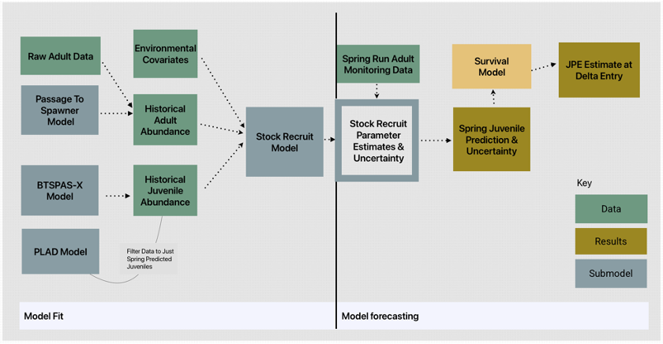
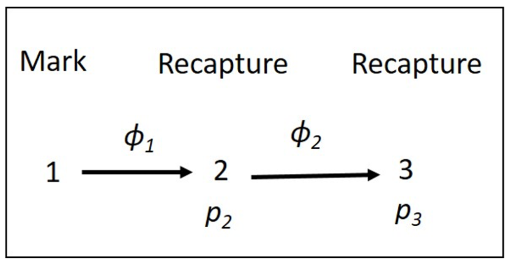
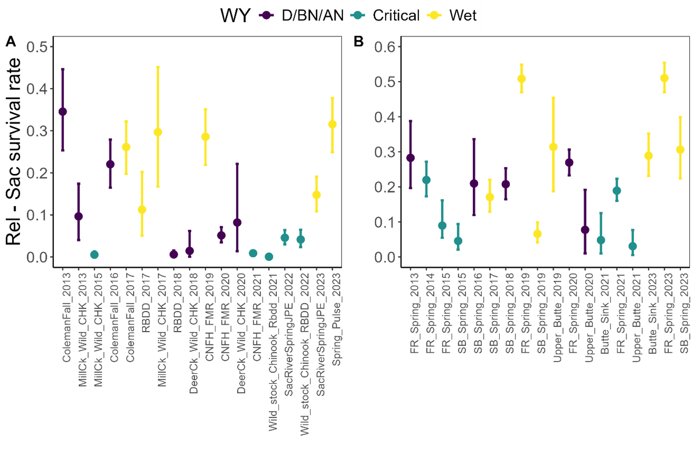

```{r, include = FALSE}
knitr::opts_chunk$set(
  collapse = TRUE,
  comment = "#>",
  fig.width = 7,
  fig.height = 5
)
```

```{r setup, include = FALSE}
library(ggplot2)
library(tidyverse)
library(bayesplot)
library(wesanderson)
library(SRJPEdata)
library(SRJPEmodel)
```

## Overview

The smolt survival model is a bayesian form of a Cormak-Jolly-Seber (CJS) model that produces estimates of smolt size spring-run survival for juveniles migrating through the Sacramento River from the upper Sacramento and its tributaries (Mainstem at Red Bluff Diversion Dam, Battle Creek, Clear Creek, Mill Creek and Deer Creek), and from Butte Creek and the Feather River to Sacramento. Combined with predicted tributary juvenile outmigrant abundances, this model will allow to obtain an estimate of the JPE.

## Submodel Objective

The purpose of the smolt survival submodel is to take in fish detection data along reaches of the Sacramento River, Butte Creek and Feather River, from various acoustic telemetry studies, and model reach specific detection probabilities and juvenile survival rates. The model could be used for forecasting by modeling survival rates as a function of individual (e.g. length, weight) and/or environmental covariates (e.g., water temperature, flow, water year type). This submodel applies to smolt-size fish (i.e. \> 80mm) and might not be suitable for smaller juveniles such as fry.

## Conceptual model

The survival model is required to estimates juvenile abundance needed for the stock recruit model or a within season outmigrant forecast model. See figure 1 below to see how it fits into the full JPE model system.

*Figure 1: Conceptual Diagram of SRJPE model. Survival sub-model shown in yellow.*Submodel Architecture



The bayesian version of a Cormak-Jolly-Seber (CJS) model uses a classic maximum likelihood (MLE) method. The Bayesian CJS model was taken from stan example at <https://mc-stan.org/docs/stan-users-guide/mark-recapture-models.html.> The model is used to estimate survival rate (ɸi) and detection probability (pi) in each reach i. We considered the initial tag location as a "mark" and subsequent detections at downstream receivers as a "recapture". For instance, ɸ1 = survival from location 1 to 2 and p2 = detection probability at location 2. Location 1 is release location. There are 4 reaches in the Sacramento River model: Release location to Woodson Bridge, Woodson Bridge to Butte Bridge, Butte Bridge to Sacramento and Sacramento to Delta exit. There are 2 reaches in the Butte Creek and Feather River models: Release locations to Sacramento and Sacramento to Delta exit. The last reach is used to further improve detection probability estimation at the Sacramento location.

*Figure 2: Diagram describing survival rate and detection probability.*Model inputs



The tagging data used for this work were obtained through the Interagency Telemetry Advisory Group (ITAG), which is an interagency coordination group formed to support the planning and implementation of a coordinated acoustic telemetry array in the Sacramento and San Joaquin Rivers, the Sacramento-San Joaquin River Delta, and San Francisco Bay. This data is processed in the SRJPEdata package to produce a `survival_model_inputs` data object.

The `SRJPEdata::survival_model_inputs` data object includes the following columns: the individual fish ID, the fish's detection history ("ch") which gives a 0 when a fish is not detected at one of the location and a 1 if it is, the study ID, fish length and weight, the fish run assignment and source (for instance fall-run from Coleman Hatchery), the date at release, the release location, the fish condition factor, the year at release, standardized name for release location, water year type (two categories), water year type (three categories), first capture location, standardized variables for fish size metrics, last capture location, distances from release location to capture sites and standardized versions of those distances.

# Running survival submodel

There are 2 versions of the STAN survival model:

-   1: No Covariate Model: To run the no covariate model, call `SRJPEmodel::prepare_survival_inputs()` with no arguments supplied.

-   2: Covariate Model: To run the covariate model, call `SRJPEmodel::prepare_survival_inputs()` with a `number_of_water_year_types` argument and an `effect` argument.

    -   `number_of_water_year_types` can be either 2 or 3

        -   2 means that water year types are grouped into two categories: 1) Critical (C)/Dry (D) and 2) Below Normal (BN)/Above Normal (AN)/Wet (W)

        -   3 means that water year types are grouped into three categories: 1) C, 2) D/BN/AN and 3) W. 

    -   `effect` can be either `no_biological_effect`, `fork_length_effect`, `weight_effect`, or `condition`

        -   `no_biological_effect` indicates that we only want to run the model with a water year type covariate.

        -   `fork_length_effect` indicates that we also want to use fork length of released fish as a covariate.

        -   `weight_effect` indicates that we also want to use weight of released fish as a covariate.

        -   `condition` indicates that we also want to use the condition of released fish as a covariate.

```{r, eval = FALSE}
library(SRJPEdata)
library(SRJPEmodel)

# Survival Model 
# Prepare survival data
survival_data <- SRJPEmodel::prepare_survival_inputs(number_of_water_year_types = 2, 
                                                     effect = "fork_length_effect")
# Fit survival model 
survival_model_fit <- SRJPEmodel::fit_survival_model(survival_inputs = survival_data)


```

# Model Output

A model outputs data frame that includes reach specific survival and detection probability rates for each year and release group.

**Table**

```{r, eval = FALSE}
# TODO confirm that this is working with Liz and then update to pull survival model fits
# Table to show model fits
survival_estimates <- extract_survival_estimates(survival_model_fit)
```

```{r, echo = FALSE, eval = FALSE}
# TODO remove eval = FALSE once we save survival_estimates in vignettes/data
write_csv(survival_estimates, "data/survival_estimates.csv")
survival_estimates <- read_csv("data/survival_estimates.csv")
# Print table
kable(survival_estimates, head(10))

```

**Plots**

The following plots show predicted survival from release to Sacramento for each release group and year along with 95% CI.

*Figure 3. Release to Sacramento survival rates for A. upper Sacramento fish and B. Butte Creek and Feather River fish, per release group. Survival rates are colored by water year type. Error bars represent the 25 and 75 percentiles.*

```{r, eval = FALSE}
# Generate survival plot
generate_survival_rate_plot(survival_estimates)

```




**Resources**

For more in depth documentation on the Spring Run JPE Survival Model please see the full report. (TODO add link once available online)
