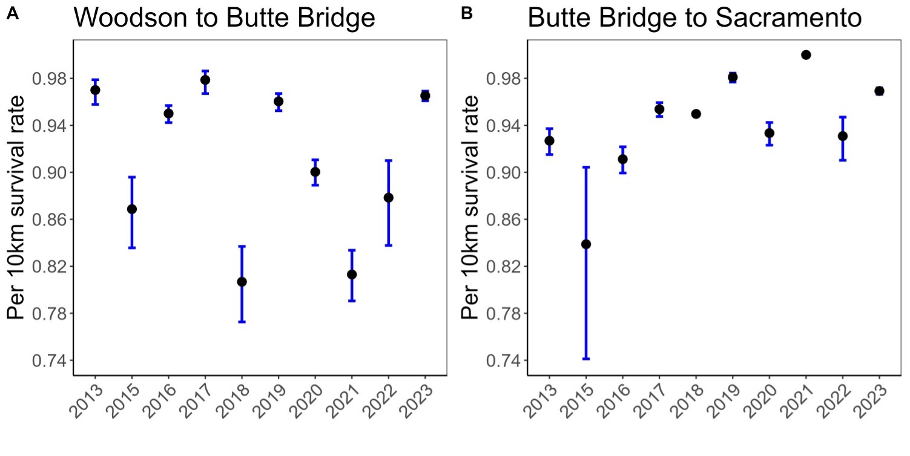

```{r, include = FALSE}
knitr::opts_chunk$set(
  collapse = TRUE,
  comment = "#>",
  fig.width = 7,
  fig.height = 5
)
```

```{r setup, include = FALSE}
library(ggplot2)
library(tidyverse)
library(bayesplot)
library(wesanderson)
library(SRJPEdata)
library(SRJPEmodel)
```

## Overview

The smolt survival model is a spatial form of a Cormak-Jolly-Seber (CJS) model that produces estimates of smolt size spring-run survival for juveniles migrating through the Sacramento River from the upper Sacramento and its tributaries (Mainstem at Red Bluff Diversion Dam, Battle Creek, Clear Creek, Mill Creek and Deer Creek), and from Butte Creek and the Feather River to Sacramento. Combined with predicted tributary juvenile outmigrant abundances, this model will allow to obtain an estimate of the JPE.

## Submodel Objective

The purpose of the smolt survival submodel is to take in fish detection data along reaches of the Sacramento River, Butte Creek and Feather River, from various acoustic telemetry studies, and model reach specific detection probabilities and juvenile survival rates. The model could be used for forecasting by modeling survival rates as a function of individual (e.g. length, weight) and/or environmental covariates (e.g., water temperature, flow, water year type). This submodel applies to smolt-size fish (i.e. \> 80mm) and might not be suitable for smaller juveniles such as fry.

## Conceptual model

The survival model is required to estimates juvenile abundance needed for the stock recruit model or a within season outmigrant forecast model. See figure 1 below to see how it fits into the full JPE model system.

*Figure 1: Conceptual Diagram of SRJPE model. Survival sub-model shown in yellow.*


## Submodel Architecture

The CJS model is used to estimate survival rate (ɸi) and detection probability (pi) in each reach i. We considered the initial tag location as a "mark" and subsequent detections at downstream receivers as a "recapture". For instance, ɸ1 = survival from location 1 to 2 and p2 = detection probability at location 2. Location 1 is release location. There are 4 reaches in the Sacramento River model: Release to Woodson Bridge, Woodson Bridge to Butte Bridge, Butte Bridge to Sacramento and Sacramento to Delta exit. There are 2 reaches in the Butte Creek and Feather River models: Release to Sacramento and Sacramento to Delta exit. The last reach is used to further improve detection probability estimation at the Sacramento location.

# Model inputs

The `SRJPEdata::survival_model_inputs` data object includes the following columns: the individual fish ID, the fish's detection history ("ch") which gives a 0 when a fish is not detected at one of the location and a 1 if it is, the study ID, fish length and weight, the fish run assignment and source (for instance fall-run from Coleman), the date at release, the release location, the fish condition factor, the year at release, and water year type.

For the Sacramento River, these additional covariates are included: the number of days a fish traveled through reach i (t_reachi), flow and water temperature at each location and their standardized values.

# Running survival submodel

```{r, eval = FALSE}
library(SRJPEdata)
library(SRJPEmodel)

# TODO update once we pull in new survival code
survival_results <- run_survival_model(survival_model_data = SRJPEdata::survival_model_inputs)

```

# Model Output

A model outputs data frame that includes reach specific survival and detection probability rates for each year.

TODO: Add table view of dataframe.

*Figure 2. Reach-specific annual smolt survival rates from the Sacramento River survival submodel. Survival rates are standardized per 10km.*



## Extract predicted juveniles by year, with uncertainty

# Resources

For more in depth documentation on the Spring Run JPE Survival Model please see the full report. (TODO link)
